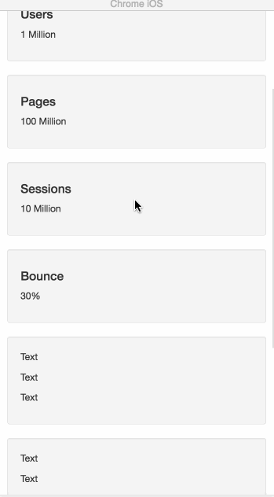

# Chrome iOS Dev Helper
A helpful jQuery extension that generates a placeholder address bar that mimics the behavior of the Chrome iOS header.

## Installation
1. Include `` on all pages after jQuery implementations

2. Open project file in browser and resize window to an apple device's dimensions

Check out the working example [here](https://srcorbetto.github.io/chrome-ios-helper/) or download the [demo HTML page](https://github.com/srcorbetto/chrome-ios-dev-helper/blob/master/index.html).